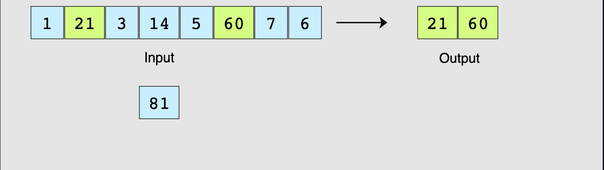

# Challenge: Find Two Numbers that Add up to "value"

Given an array and a number "value", find two numbers from the array that sum to 'value'. Implement your solution in JavaScript and see if your output matches with the correct output.

## Problem Statement

In this problem, you have to implement the `findSum(arr, value)` function, which takes an array `arr`, a number and `value` as input and returns an array of two numbers that add up to `value`.

### Input

An array and a number `value`

### Output

An array with two integers `a` and `b` ([`a`,`b`]) that add up to `value`

### Sample Input

```Javascript
arr = [1,21,3,14,5,60,7,6]
value = 81
```

### Sample Output

```Javascript
arr = [21,60]
```


